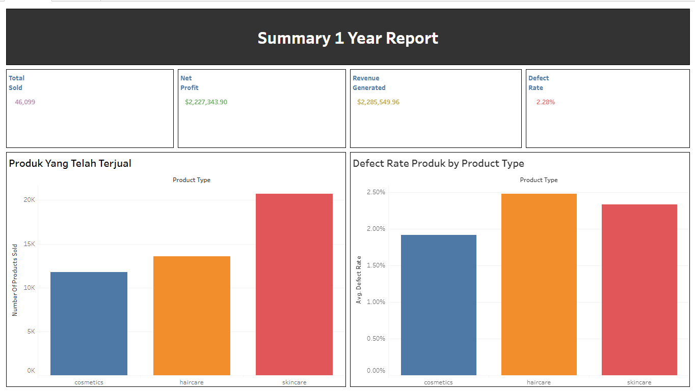
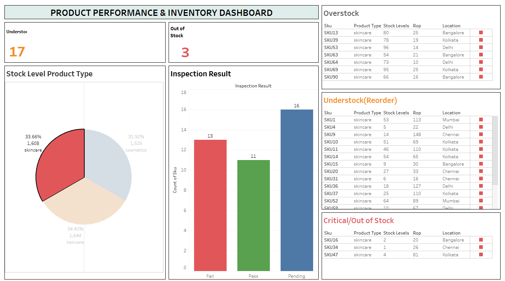

# 📦 Supply Chain Performance & Inventory Risk Analysis

**Analisis performa produk, biaya operasional, dan risiko inventori (safety stock, ROP, stock status) untuk mendukung keputusan restocking pada perusahaan consumer goods (skincare, haircare, cosmetics).**

🔗 **Dashboard Interaktif (Tableau Public):** [Supply Chain Report & Product Performance](https://public.tableau.com/app/profile/doni.ramadhani/viz/SupplyChainReportandproductPerformance/Dashboard2)
📂 **Sumber Data:** [Kaggle - Supply Chain Dataset](https://www.kaggle.com/datasets/amirmotefaker/supply-chain-dataset) oleh Amir Motefaker

---

## 🧭 Business Case

Perusahaan ini menjual produk di 3 kategori — **skincare, haircare, dan cosmetics** — melalui beberapa supplier, moda transportasi, dan lokasi gudang (Mumbai, Kolkata, Chennai, Delhi, Bangalore). Selama ini keputusan restocking hanya berdasarkan intuisi tim gudang, tanpa acuan angka **safety stock** maupun **reorder point (ROP)** yang jelas.

Akibatnya muncul dua masalah yang sama-sama membebani cashflow:
1. Sebagian SKU sering **kehabisan stok** saat permintaan sedang tinggi, sehingga kehilangan potensi penjualan.
2. Sebagian SKU lain **menumpuk di gudang** melebihi kebutuhan, sehingga modal tertahan di inventori yang lambat berputar.

Tim manajemen membutuhkan sebuah laporan berbasis data yang dapat menjawab: **produk mana yang aman, mana yang perlu segera di-reorder, dan mana yang berisiko out-of-stock atau overstock** — lengkap dengan indikator performa tahunan (penjualan, profit, revenue, defect rate).

---

## ⭐ STAR Framework

### 🔹 Situation
Dataset berisi 100 SKU dengan atribut lengkap: harga, jumlah terjual, stok, lead time supplier & manufaktur, biaya produksi/pengiriman/transportasi, hasil inspeksi kualitas, hingga defect rate. Namun dataset **tidak menyediakan** metrik turunan yang penting untuk keputusan inventori seperti *safety stock*, *reorder point*, *net profit*, maupun *status stok* (aman/understock/overstock/kritis).

### 🔹 Task
Mengolah data mentah menjadi tabel siap analisis yang berisi metrik keuangan (revenue, biaya operasional, net profit) dan metrik manajemen inventori (safety stock, ROP, status stok), kemudian menyajikannya dalam dashboard yang mudah dibaca oleh tim manajemen untuk mendukung keputusan restocking.

### 🔹 Action
1. **Data Processing dengan SQL** (`query.sql`)
   - Menghitung `revenue_generated` = jumlah terjual × harga.
   - Menghitung `total_operational_cost` = biaya manufaktur + biaya pengiriman + biaya transportasi, dan `net_profit` = revenue − total biaya operasional.
   - Menghitung `total_lead_time` = lead time supplier + lead time manufaktur (bukan cuma 1 komponen lead time saja, supaya lebih realistis).
   - Menghitung `daily_demand` dengan asumsi *number of products sold* adalah angka tahunan (dibagi 365).
   - Menghitung **Safety Stock** dan **Reorder Point (ROP)** dengan rumus statistik standar:
     - `Safety Stock = Z × CV × Demand Harian × √(Total Lead Time)`
     - `ROP = (Demand Harian × Total Lead Time) + Safety Stock`
     - Asumsi yang dipakai: **Z-score = 1.65** (service level ±95%) dan **Coefficient of Variation = 0.25** (variabilitas moderat), karena data historis harian tidak tersedia sehingga CV memakai proxy.
   - Melakukan klasifikasi `stock_status` menjadi 4 kategori:
     - **Critical / Out of Stock Risk** — stok ≤ safety stock
     - **Understock (Reorder)** — stok ≤ ROP
     - **Overstock** — stok > ROP × 2.5 (multiplier overstock)
     - **Normal** — di luar ketiga kondisi di atas
   - Output disimpan sebagai `exer.csv`.
2. **Visualisasi dengan Tableau**
   - `exer.csv` diimpor ke Tableau Public untuk membangun 2 dashboard interaktif dan dipublikasikan online.

### 🔹 Result
Dua dashboard berhasil dibangun dan dipublikasikan secara online:

#### 📊 Dashboard 1 — Summary 1 Year Report


Ringkasan performa tahunan seluruh kategori produk:
| Metrik | Nilai |
|---|---|
| Total produk terjual | 46,099 unit |
| Revenue generated | $2,285,549.96 |
| Net profit | $2,227,343.90 |
| Rata-rata defect rate | 2.28% |

Kategori **skincare** menyumbang volume penjualan tertinggi (~20K unit), tapi juga memiliki jumlah SKU berstatus understock/overstock terbanyak — artinya kategori ini paling butuh perhatian dalam manajemen stok. Sementara **haircare** justru punya rata-rata defect rate tertinggi di antara ketiga kategori, jadi patut dicermati dari sisi kualitas.

#### 📊 Dashboard 2 — Product Performance & Inventory Dashboard


Dashboard ini memetakan status stok tiap SKU secara individual, lengkap dengan lokasi gudang, hasil inspeksi kualitas, dan perbandingan stok vs ROP:

| Status Stok | Jumlah SKU | Distribusi Kategori |
|---|---|---|
| 🔴 Critical / Out of Stock Risk | 7 | haircare (3), skincare (3), cosmetics (1) |
| 🟠 Understock (Reorder) | 35 | skincare (17), haircare (13), cosmetics (5) |
| 🔵 Overstock | 28 | haircare (11), cosmetics (10), skincare (7) |
| 🟢 Normal | 30 | skincare (13), cosmetics (10), haircare (7) |

Dari sisi kualitas, hasil inspeksi menunjukkan 13 SKU *fail*, 11 *pass*, dan 16 masih *pending* — porsi *fail* yang cukup besar ini penting dikaitkan dengan keputusan restocking, karena tidak semua SKU yang understock layak buru-buru diisi ulang jika kualitasnya bermasalah.

---

## ✅ Rekomendasi Bisnis

### 🔴 1. Produk Kritis (Critical / Out of Stock Risk) — 7 SKU, prioritas tertinggi
SKU seperti **SKU2, SKU16, SKU33, SKU34, SKU47, SKU68, SKU78** memiliki stok di bawah atau setara safety stock — beberapa bahkan tersisa 0–2 unit (SKU68 di Bangalore, SKU34 & SKU16 masing-masing hanya 1–2 unit). Beberapa SKU ini justru menyumbang net profit tinggi (SKU47 ≈ $86 ribu, SKU33 ≈ $39 ribu), sehingga kehabisan stok pada SKU ini berarti **kehilangan penjualan pada produk yang justru paling menguntungkan**.
- **Rekomendasi:** lakukan *emergency reorder* dalam 24–48 jam untuk ke-7 SKU ini, terutama yang berlokasi di Mumbai dan Bangalore (lead time relatif lebih pendek), dan evaluasi apakah safety stock perlu dinaikkan khusus untuk SKU dengan kontribusi profit tinggi.

### 🟠 2. Produk Understock (Reorder) — 35 SKU, terkonsentrasi di skincare & haircare
Sebagian besar SKU understock ada di kategori **skincare (17 SKU)** dan **haircare (13 SKU)** — sejalan dengan temuan di Dashboard 1 bahwa skincare adalah kategori dengan penjualan tertinggi, jadi wajar permintaannya sering melampaui stok yang tersedia.
- **Rekomendasi:** naikkan frekuensi replenishment khusus kategori skincare & haircare, dan evaluasi kontrak lead time dengan supplier di kota-kota dengan lead time panjang agar siklus reorder bisa dipercepat.

### 🔵 3. Produk Overstock — 28 SKU, modal tertahan di gudang
28 SKU (terutama haircare 11 dan cosmetics 10) memiliki stok jauh melebihi ROP (contoh: SKU51 stok 100 vs ROP 21, SKU59 stok 100 vs ROP 23). Rata-rata defect rate kelompok ini justru paling rendah (1.90%) — artinya kualitas bukan masalah, murni kelebihan pasokan.
- **Rekomendasi:** buat program *clearance*/diskon bertahap untuk SKU overstock, kurangi kuantitas order berikutnya, dan alihkan sebagian anggaran pembelian ke SKU understock yang lebih menguntungkan agar modal kerja lebih efisien.

### ⚠️ 4. Perhatian Khusus — Kaitan Kualitas & Stok
13 SKU dengan hasil inspeksi **Fail** perlu dicek silang dengan status stoknya — jika ada SKU yang berstatus *Understock* namun juga *Fail* inspeksi, reorder otomatis berisiko menambah produk cacat ke gudang. Sebaliknya, defect rate rata-rata paling tinggi justru ada pada kelompok *Understock (Reorder)* (2.54%), jadi proses reorder untuk kelompok ini sebaiknya disertai audit kualitas supplier terlebih dahulu, bukan hanya mengejar kuantitas.

---

## 🛠️ Tools yang Digunakan
- **SQL** — pemrosesan & transformasi data mentah (`query.sql`)
- **Tableau Public** — dashboarding & visualisasi interaktif
- **Kaggle Dataset** — sumber data mentah supply chain

## 📁 Struktur Repo
```
├── query.sql                 # Script transformasi data (safety stock, ROP, stock status)
├── exer.csv                  # Data hasil olahan, siap dipakai di Tableau
├── images/
│   ├── dashboard_1_summary_report.png
│   └── dashboard_2_inventory_performance.png
└── README.md
```

---

*Catatan: business case pada dokumen ini merupakan narasi ilustratif yang disusun untuk keperluan portofolio, berdasarkan analisis dari dataset publik Kaggle di atas.*
